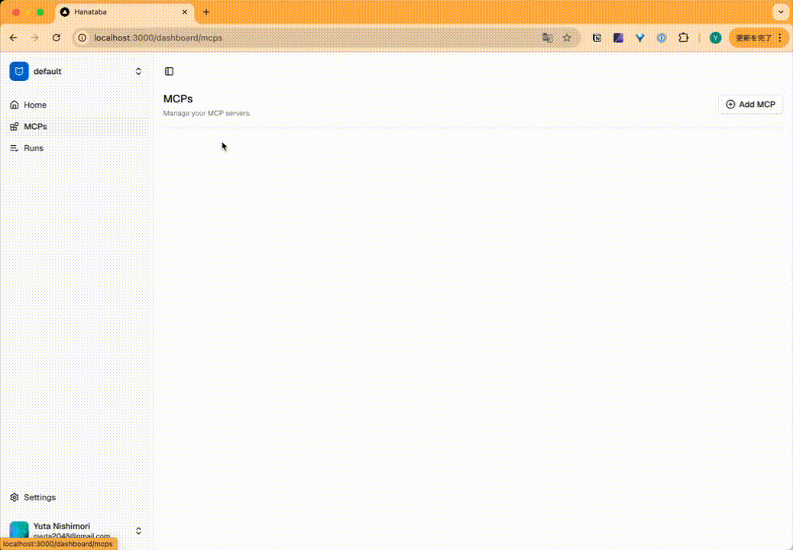

<p align="center">
  
</p>

<p align="center">
  An open-source composio alternative powered by Model Context Protocol (MCP), built with Next.js and the AI SDK by Vercel.
</p>


https://www.loom.com/share/1f478bb921d34270b2fba4e965ab8f2e?sid=ac5fea41-b772-405a-8b70-7803c4fe8b2a

## Features

- Full integration with [Model Context Protocol (MCP)](https://modelcontextprotocol.io) servers to expand available tools and capabilities.
- [shadcn/ui](https://ui.shadcn.com/) components for a modern, responsive UI powered by [Tailwind CSS](https://tailwindcss.com).
- Built with the latest [Next.js](https://nextjs.org) App Router.


## Getting Started

```bash
cp .env.sample .env
docker compose up
npx drizzle-kit migrate
pnpm dev
```